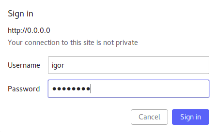
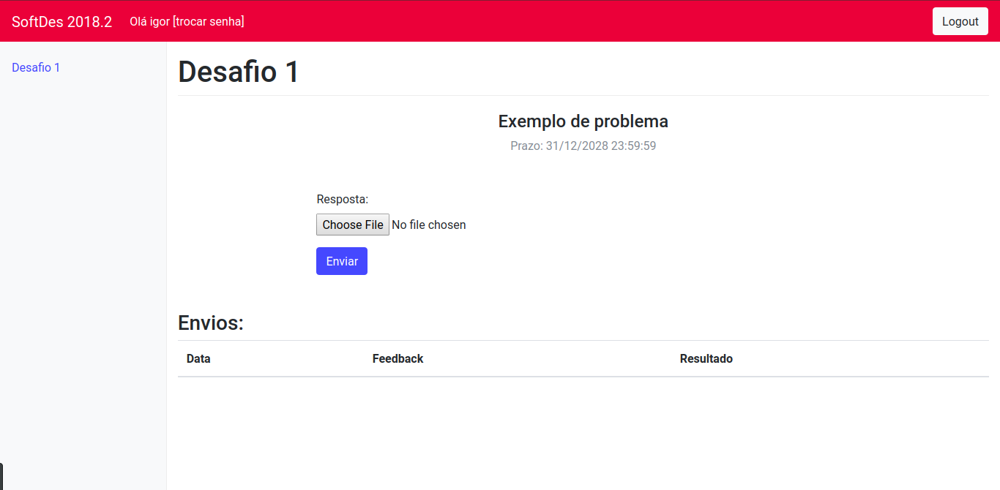
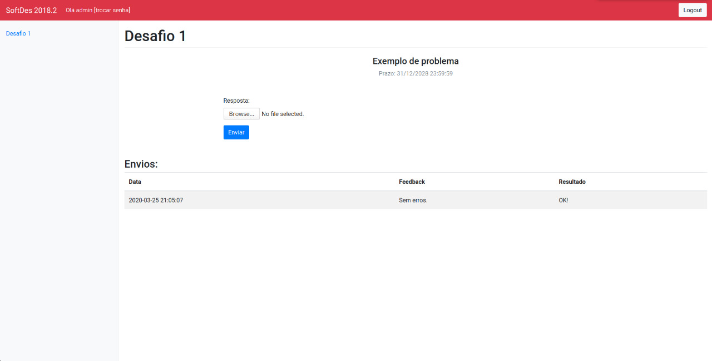
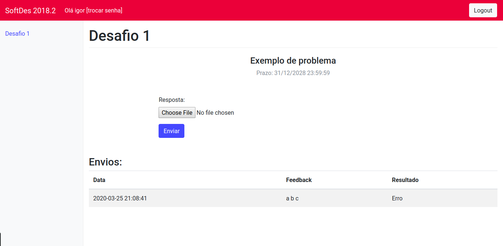

# Guia de usuário para alunos

## Entrando no Servidor de Desafios

- Para preparar o ambiente e executar o Servidor de Desafios, veja este [tutorial](desenvolvimento.md "tutorial").
- Após entrar na página do Servidor de Desafios, uma janela pop-up aparecerá e nela você deverá inserir o seu nome de usuário e a sua senha, como mostra a imagem abaixo, e clicar no botão "Sign in".

- Pronto, você está logado na página do Servidor de Desafios e já pode começar suas atividades.

## Enviando solução correta para desafio

- Após logar com seu usuário e senha na página do Servidor de Desafios, clique no desafio que você quer enviar a solução no menu do lado esquedo da página.
- Clique no botão "Choose file", escolha o arquivo com a sua solução do desafio e clique em "Abrir", como mostram as imagens abaixo.

- Ao clicar no botão "Enviar", você poderá verificar na seção "Envios" o seu feedback e o resultado da sua solução. Caso o resultado seja "OK!" e o feedback seja "Sem erros." a sua solução está correta, como mostra a imagem abaixo.

 

## Enviando solução errada para desafio

- Caso ao clicar no botão "Enviar" aparecer outro resultado nos campos "Feedback" e "Resultado" da seção "Envios", significa que a sua solução está incorreta ou parcialmente correta. A imagem abaixo exemplifica esta situação.

