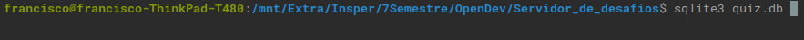

# Guia de usuário para professores

Nesta página você encontrará um passo a passo de como adicionar novos usuários e novos desafios ao Servidor de Desafios.

## Adicionando usuários

- Para adicionar um novo usuário ao Servidor de Desafios será necessário abrir o arquivo _users.csv_ em um editor de texto e escrever o login do usuário, a senha e o tipo do usuário.
	- Os tipos de usuário possíveis são "admin", para usuários que podem fazer qualquer tipo de ação no Servidor de Desafios (como professores) e "aluno" para usuários que tem suas ações restringidas no Servidor de Desafios (como alunos).
	- Essas três informações devem estar na mesma linha e devem ser separadas por vírgulas, como mostra a imagem abaixo.


- Será necessário abrir um terminal na pasta onde se encontram os arquivos do Servidor de Desafios e executar o arquivo _adduser.py_

    **``python3 adduser.py``**

O output esperado está na imagem abaixo.


## Adicionando desafios

- Para adicionar um novo desafio ao Servidor de Desafios será necessário adicionar no banco de dados através do terminal.
    Abrir o terminal no diretório do Servidor de Desafios e executar o seguinte comando

    **``sqlite3 quiz.db``**

    Como está na imagem abaixo




No terminal SQLite3, executar o seguinte comando

**```Insert into QUIZ(numb, release, expire, problem, tests, results, diagnosis) values ([ numero ], [Data de Inicio],[Data de Expiração],[Exemplo do problema],[Entradas de Teste],[Resultado Esperado],[Diagnóstico para cada entrada]);```**

Como no exemplo abaixo


